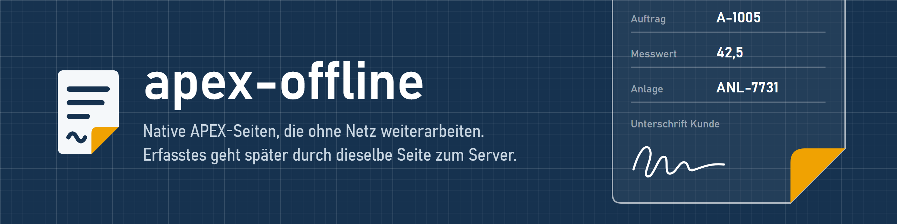
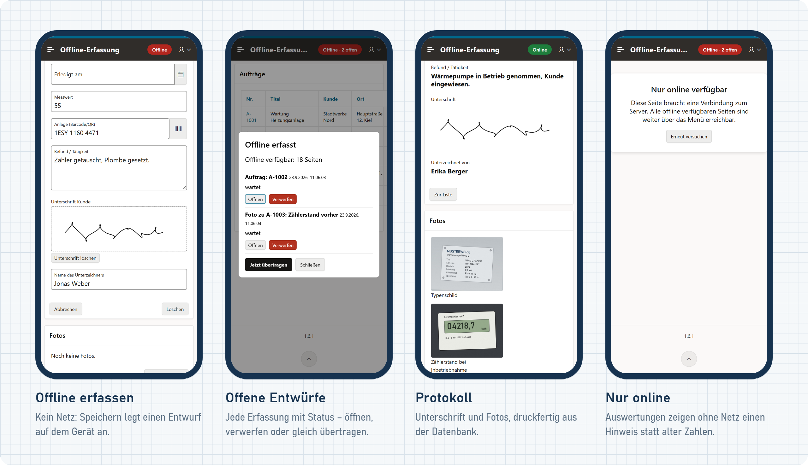
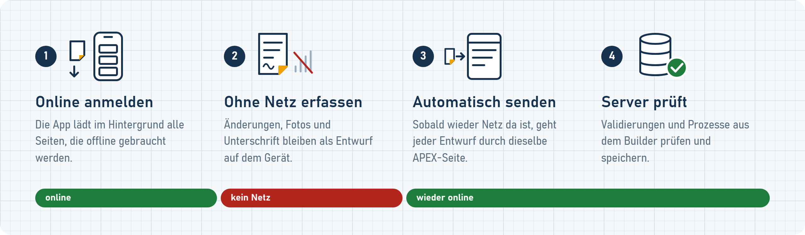

# Offline-Erfassung für Oracle APEX

Die App wird ganz normal im **APEX Builder** gebaut – Seiten, Formulare, Validierungen, Prozesse.
Drei statische Dateien machen daraus eine installierbare PWA, mit der man auch **ohne Verbindung
(VPN weg, Funkloch)** bereits geöffnete Aufträge, Anfragen oder Anlagen bearbeiten, Barcodes und QR-Codes
scannen und unterschreiben lassen kann. Was offline erfasst wurde, wird später **durch dieselbe
APEX-Seite** abgesendet – mit genau den Validierungen und Prozessen aus dem Builder.

Es gibt keine JSON-Definitionen, keinen Seitengenerator, kein eigenes Server-API und keinen Nachbau
der Formulare in JavaScript. Ein neues Feld ist ein neues Item im Builder, sonst nichts.



## So funktioniert es



1. **Offline-Vorrat:** Beim ersten Online-Aufruf je Sitzung lädt die App im Hintergrund alle Seiten, die
   offline gebraucht werden – ohne dass sie jemand öffnen muss (siehe unten). Der Service Worker speichert
   sie und jede weitere aufgerufene Seite. Ohne Verbindung (oder wenn der Server 4 Sekunden nicht
   antwortet) liefert er die zuletzt gespeicherte Fassung; die Anzeige nennt dann ihren Stand.
2. **Offline speichern:** Auf Seiten mit der CSS-Klasse `offline-form` fängt `offline.js` das Absenden
   ab, wenn der Server nicht erreichbar ist, prüft die Pflichtfelder wie online und legt nur die
   **geänderten Felder** (alter und neuer Wert) als Entwurf im Browser ab (IndexedDB).
3. **Übertragen:** Sobald der Server wieder erreichbar ist, lädt `offline.js` jede betroffene Seite
   unsichtbar, setzt die erfassten Werte und sendet sie ab – wie ein Anwender es täte. Erfolg,
   Validierungsfehler und Verbindungsabbruch werden erkannt.
4. **Konflikte:** Hat jemand dasselbe Feld inzwischen auf dem Server geändert, wird nichts
   überschrieben. Der Anwender öffnet den Entwurf, sieht den Server-Wert direkt am Feld und entscheidet.

## Die Bausteine

| Datei (`apex_toolkit/shared-components/static-files/`) | Zweck |
|---|---|
| `offline.js` | Entwürfe, Übertragung, Statusanzeige, Unterschrift, Scan, Vorab-Laden |
| `offline-sw.js` | Service-Worker-Hook: Seiten speichern und offline ausliefern |
| `offline.css` | Statusanzeige, Unterschriftenfeld, Scanner, Druck |
| `messages.css` | optional: Seitenmeldungen oben mittig und kompakt (unabhängig von der Offline-Schicht) |
| `vendor/barcode-detector/` | optional: Barcode-/QR-Decoder für iPhone, Windows, Firefox ([Fremdcode](THIRD-PARTY-NOTICES.md)) |

Datenbankobjekte braucht die Offline-Schicht nicht. `sql/install.sql` legt nur die Objekte der Beispiel-App an.

## In eine eigene App übernehmen (einmal je App)

1. **Shared Components → Static Application Files:** `offline.js`, `offline-sw.js`, `offline.css`
   hochladen, für das Scannen auf iPhone/Windows zusätzlich die drei Dateien aus
   `vendor/barcode-detector/` unter demselben Pfad (`zxing_reader.wasm` mit MIME-Typ `application/wasm`).
2. **Application Definition → User Interface:** JavaScript File URLs `#APP_FILES#offline.js`,
   CSS File URLs `#APP_FILES#offline.css` (und `#APP_FILES#messages.css`), *Auto-Dismiss Success
   Messages* einschalten – Erfolgsmeldungen erscheinen dann oben mittig und verschwinden nach 5 Sekunden,
   Fehlermeldungen bleiben stehen, bis sie geschlossen oder behoben sind.
3. **Progressive Web App:** aktivieren und installierbar machen; *Service Worker Hooks* → File URL
   `#APP_FILES#offline-sw.js`. Voraussetzung: HTTPS und Friendly URLs (Standard).
4. **Security → Browser Security → Embed in Frames:** *Allow from same origin* (die Übertragung lädt
   die Seite unsichtbar in einem Rahmen der eigenen App).
5. Empfohlen: **Session Management** – längere *Maximum Session Length / Idle Time* für Arbeitstage im
   Außendienst (Beispiel-App: 24 h / 8 h). Solange die Sitzung gilt, wird ohne neue Anmeldung übertragen.

## Eine Seite offlinefähig machen (je Formularseite)

| Wo im Builder | Einstellung | Warum |
|---|---|---|
| Page → Appearance → CSS Classes | `offline-form` | nur diese Seiten erfassen offline |
| Primärschlüssel-Item → Security → Session State Protection | *Checksum Required – User Level* (der Formular-Assistent setzt *Session Level* – umstellen) | die Prüfsumme in Links bleibt nach neuer Anmeldung gültig |
| Links und Buttons auf die Seite → Set Items | Primärschlüssel übergeben, bei „Neu" **leer** | ohne Item wäre die Prüfsumme an die Sitzung gebunden |
| Buttons → Button Name | Builder-Standard behalten: `CREATE`, `SAVE`, `DELETE` | am Namen erkennt `offline.js` Neuanlage und Löschen; heißt der Anlegen-Button anders, überschreibt die nächste Offline-Neuanlage die vorige |
| Page → Appearance → CSS Classes, zusätzlich (optional) | `offline-queue` | Speichern legt immer erst einen Entwurf an, auch online, kehrt sofort zurück und überträgt im Hintergrund; ein abgebrochenes Senden wird einfach wiederholt. Nur für Seiten, deren Prozess doppelt Gesendetes erkennt (Beispiel: Seite 4 „Foto“). Lehnt der Server ab, steht das in der Entwurfsliste (*fehler*), nicht am Feld |

Alles andere bleibt wie gewohnt: Felder, Pflichtfelder, Validierungen, *Form – Automatic Row
Processing*, Verzweigungen. Beispiel: `apex_toolkit/pages/p00002-auftrag.apx`.

## Prüfungen offline

Beim Offline-Speichern prüft der Browser alles, was APEX am **Item selbst** festlegt: *Value Required*,
*Maximum Length*, bei Zahlenfeldern *Minimum/Maximum Value*, bei Textfeldern der Subtyp (E-Mail, URL).
Diese Regeln gelten online zusätzlich auf dem Server – eine Regel, an einer Stelle, ohne JavaScript.
Beispiel: `P2_MESSWERT` mit Minimum 30 und Maximum 90 lehnt 150 offline sofort am Feld ab.

**Validierungen** (Page → Validations, PL/SQL) brauchen die Datenbank. Sie laufen bei der Übertragung;
schlägt eine fehl, bekommt der Entwurf den Status *fehler* mit der Meldung, und der Anwender korrigiert ihn
auf der Seite. Einfache Bereichs- und Pflichtprüfungen deshalb am Item festlegen, echte Geschäftsregeln
(Abgleich mit anderen Tabellen, mehrere Datensätze) als Validierung.

Die Meldungen der Browser-Prüfung sind APEX-Texte. `shared-components/messages.apx` stellt die wichtigsten
(und die Knöpfe der APEX-Dialoge) auf Deutsch (*Shared Components → Text Messages*, „Used in JavaScript"), falls das deutsche Sprachpaket
auf der Instanz fehlt.

## Seiten nur für online

Seiten, die ohne Verbindung keinen Sinn ergeben (Auswertungen, Verwaltung), bekommen die Page-CSS-Klasse
**`online-only`** (Page → Appearance → CSS Classes). Ohne Verbindung zeigen sie statt des Inhalts den
Hinweis „Nur online verfügbar"; Kopfleiste und Menü bleiben, sodass man zu den offline verfügbaren Seiten
wechseln kann. Reißt die Verbindung ab, während die Seite offen ist, erscheint der Hinweis sofort; kommt
sie zurück, lädt die Seite ihren aktuellen Inhalt. Eine gespeicherte Fassung zeigt nie veraltete Zahlen –
`offline.css` blendet ihren Inhalt aus, bevor das JavaScript läuft. Beispiel: Seite 5 „Auswertung".

## Bedienelemente per CSS-Klasse

| Klasse | Wo | Ergebnis |
|---|---|---|
| `offline-signature` | Textarea-Item → Advanced → CSS Classes | Unterschriftenfeld; Wert ist ein Bild als Data-URL (Spalte CLOB, Session State Data Type CLOB, Label-Template „Optional – Above") |
| `offline-photo` | Textarea-Item → Advanced → CSS Classes | Fotofeld: Kamera oder Galerie, Vorschau; das Bild wird im Browser auf höchstens 1600 Pixel verkleinert und ist als JPEG-Data-URL der Wert des Items (keine Formularspalte; Session State Data Type CLOB, Storage *Per Request*). Ein Prozess speichert es als Bild, siehe [Fotos am Auftrag](#fotos-am-auftrag) |
| `offline-scan` | Textfeld-Item → Advanced → CSS Classes | Kamera-Taste für Barcode und QR-Code; Hand- und Bluetooth-Scanner tippen ohnehin ins Feld |
| `offline-prefetch` | Region (z. B. Bericht) → Appearance → CSS Classes | die Ziele ihrer Links und Buttons gehören zum Offline-Vorrat (siehe unten) |
| `offline-drafts` | Region → Appearance → CSS Classes | zeigt oben in der Region die noch nicht übertragenen Neuanlagen der Seiten, auf die ihre Links und Buttons zeigen – mit Vorschaubild, wenn es ein Foto ist, und Status. Am Auftrag also die Fotos hinter „Foto hinzufügen“, in der Liste die offline angelegten Aufträge. Alles kommt aus dem Gerät, nichts vom Server |
| `offline-lightbox` | Region → Appearance → CSS Classes | Klick auf ein Bild in der Region zeigt es groß (auch die Vorschaubilder von `offline-drafts`) |

## Offline-Vorrat: was ohne vorheriges Öffnen offline verfügbar ist

Beim ersten Online-Aufruf je Sitzung lädt die App im Hintergrund – die Anzeige zeigt dabei „Online · lädt“:

1. alle Seiten des **Navigationsmenüs**,
2. von dort aus, auch mehrstufig, die Ziele aller **Links und Buttons in Regionen mit `offline-prefetch`**.

In der Beispiel-App sind das die Auftragsliste (Menü), jeder Auftrag und jedes Protokoll (Links im Bericht),
die Anlegeseite (Button „Neuer Auftrag" in derselben Region) und je Auftrag die Seite „Foto hinzufügen"
(Button in der Region „Fotos" des Auftrags), dazu die Auswertung (Menü) – bei fünf Aufträgen 18 Seiten, ohne
einen Klick. Die Liste der Entwürfe zeigt, wie viele Seiten offline verfügbar sind.

Damit eine Seite zum Vorrat gehört, muss sie also im Menü stehen oder von einer `offline-prefetch`-Region
aus verlinkt sein. Übersprungen werden Links mit Request (sie könnten auf der Zielseite etwas auslösen),
Links auf modale Dialoge und fremde Apps sowie Download-Adressen wie `apex_util.get_blob`: **Bilder vom Server
lädt der Vorrat nie.**

Der Vorrat zählt nur Seiten, die wirklich frisch vom Server kamen. Reißt die Verbindung ab, kommt eine Seite
nicht oder läuft die Sitzung ab, merkt er sich, wo er stand: Die Anzeige zeigt dann **„Vorrat unvollständig“**,
und er macht weiter, sobald die Verbindung zurück ist (auch wenn die App wieder in den Vordergrund kommt,
sonst spätestens alle zwei Minuten). Erst wenn „lädt“ und „unvollständig“ verschwunden sind, ist alles da.
Eine Seite, die dreimal nicht kommt (z. B. ohne Berechtigung), gilt als nicht abrufbar; die Liste der
Entwürfe nennt ihre Zahl.
Danach kommen neue Datensätze beim Öffnen der Liste dazu; geänderte Datensätze kommen beim Öffnen, mit dem
Knopf **„Vorrat neu laden“** in der Liste der Entwürfe oder mit der nächsten Sitzung. Höchstens 300 Seiten je
Sitzung; ist die Grenze erreicht, steht dort „Vorrat begrenzt“ und es wird nicht selbst weitergeladen.

Die Liste in der `offline-prefetch`-Region muss deshalb **auf die eigenen Datensätze gefiltert** sein
(z. B. `where techniker = :APP_USER` und der heutige Tag, siehe [Außendienst](#außendienst-disposition-und-techniker)).
Sie muss ein **Classic Report** oder eine Template Component sein: Cards baut der Browser erst aus JSON
zusammen, der Vorrat findet darin keine Links. Und sie muss alle Zeilen auf einmal zeigen (*Number of Rows*
mindestens so groß wie der größte Tagesbestand, Standard ist 15): der Vorrat sieht nur angezeigte Zeilen.

## Seiten im Offline-Vorrat

Der Vorrat ruft jede Seite vollständig auf dem Server auf: *Before Header*-Prozesse, Berechnungen,
Regionsquellen und PL/SQL-Anzeigen laufen wie bei einem Klick. Für Seiten im Vorrat gilt deshalb:

1. **Beim Seitenaufbau nichts schreiben:** keine Lesemarkierung („angenommen“), kein Zugriffsprotokoll, keine
   Sperren.
2. **Keine Nummern beim Seitenaufbau vergeben:** jede Offline-Neuanlage aus derselben gespeicherten Seite
   bekäme dieselbe Nummer. Nummern im Speichern-Prozess vergeben.
3. **Links mit Nebenwirkung** bekommen einen Request (der Vorrat überspringt sie) oder stehen außerhalb von
   `offline-prefetch`-Regionen.
4. **Verzweigungen vor dem Seitenaufbau** (*Before Header Branch*): gespeichert wird die Zielseite unter der
   aufgerufenen Adresse.
5. **Session State:** nach dem Vorrat enthält er den zuletzt geladenen Datensatz. Schlüssel deshalb in Links
   übergeben (wie die Beispiel-App), Ajax-Aktualisierungen und serverseitigen Dynamic Actions die Items unter
   *Page Items to Submit* mitgeben, Application Items nicht als Datensatz-Kontext verwenden.
6. **Bedingungen sind eingefroren:** Serverseitige Bedingungen, die vom Zustand des Datensatzes abhängen,
   gelten in der gespeicherten Seite so, wie sie beim Laden waren.

## Was der Anwender sieht

In der Kopfleiste neben dem angemeldeten Benutzer steht der Zustand: **Online**, **Offline** oder
**„2 offen"** (Seiten ohne Navigationsleiste zeigen ihn unten links), dazu **„sendet“** während der
Übertragung – die Zahl offener Entwürfe sinkt dabei Entwurf für Entwurf – und **„lädt“** während des
Offline-Vorrats. **„Anmeldung nötig“** heißt: die Sitzung ist abgelaufen, die Entwürfe warten; die Liste der
Entwürfe hat dann den Knopf *Anmelden und übertragen*. In Listen sind Datensätze mit offenem Entwurf markiert
(●). Ein Klick auf die Anzeige öffnet die Liste der Entwürfe mit *Öffnen*, *Verwerfen* und *Jetzt übertragen*;
Foto-Entwürfe zeigen ein Vorschaubild. Jeder Entwurf heißt wie die Seite plus ihr erster ausgefüllter Wert,
z. B. „Auftrag: A-1005" – das kennzeichnende Feld gehört also nach oben. Neuanlagen erscheinen außerdem dort,
wo sie hingehören (Regionen mit `offline-drafts`): ein noch nicht übertragenes Foto am Auftrag, ein offline
angelegter Auftrag in der Liste. Bilder, die offline nicht verfügbar sind, zeigen „Bild nur online“ statt eines
kaputten Bildes.

Wartende Entwürfe gehen automatisch raus: beim Laden einer Seite, sobald die Verbindung zurück ist, wenn die
App wieder in den Vordergrund kommt und sonst spätestens alle zwei Minuten.

Eine gespeicherte Fassung zeigt in der Anzeige ihren Stand, z. B. **„Offline · Stand 07:42“** (ältere Tage mit
Datum) – auch online, wenn der Server zu langsam war. Kommt die Verbindung zurück, lädt eine gespeicherte Liste
oder Anzeigeseite von selbst den aktuellen Stand; Erfassungsseiten nicht, damit nichts verloren geht, was
gerade eingegeben oder fotografiert wird. Ein ⚠ vor der Anzeige heißt „Vorrat unvollständig“ oder „Anmeldung
nötig“.

| Status | Bedeutung |
|---|---|
| wartet | wird automatisch übertragen, sobald der Server erreichbar ist (ggf. nach Anmeldung) |
| fehler | der Server hat abgelehnt (z. B. Validierung) – öffnen, korrigieren, speichern |
| konflikt | dasselbe Feld wurde inzwischen auf dem Server geändert – öffnen, entscheiden, speichern |
| unklar | Neuanlage, bei der die Verbindung während des Speicherns abriss – erst prüfen, ob der Datensatz schon existiert, dann öffnen oder verwerfen. Auf Seiten mit `offline-queue` kommt das nicht vor: dort wird einfach erneut gesendet |

## Fotos am Auftrag

Beispiel für Anhänge, die offline entstehen: beliebig viele Fotos je Auftrag in der Tabelle
`OE_AUFTRAG_FOTO`. Die Seite 4 „Foto" ist ein natives Formular mit dem Textarea-Item `P4_FOTO` (CSS-Klasse
`offline-photo`) und einer Bemerkung. Der Auftrag (Seite 2) listet seine Fotos in der Region „Fotos", deren
Button „Foto hinzufügen" die Seite 4 mit dem Auftrag öffnet.

**Übertragen als Data-URL, gespeichert als Bild.** Das Foto wird im Browser auf 1600 Pixel verkleinert (etwa
150–400 KB) und geht als Data-URL durch den normalen Submit von Seite 4 – online genauso wie bei der
Übertragung eines Offline-Entwurfs. APEX überträgt auch Item-Werte mit mehreren 100 000 Zeichen. Statt
*Automatic Row Processing* ruft ein Prozess `pck_oe_auftrag_foto_dml.anlegen` auf
(`sql/pck_oe_auftrag_foto_dml.sql`): Kopf abschneiden, Base64 dekodieren, Bildsignatur prüfen, als BLOB mit
MIME-Typ speichern. Als Data-URL in einem CLOB bräuchte ein Foto das 2,7-Fache seiner JPEG-Größe (Base64 und
2 Byte je Zeichen in einer AL32UTF8-Datenbank), als BLOB das 1,0-Fache.

**Doppelt gesendet zählt einmal.** Dieselben Bytes am selben Auftrag werden nur einmal gespeichert; der
Auftrag wird dafür kurz gesperrt, eine neuere Bemerkung wird übernommen. Ein Entwurf wird byte-gleich
gesendet. Deshalb hat Seite 4 zusätzlich die Klasse `offline-queue`: Speichern legt auch online erst einen
Entwurf an und kehrt sofort zum Auftrag zurück, das Foto geht im Hintergrund raus. Bei schlechtem Netz wartet
der Techniker also nicht auf den Upload, und ein abgebrochenes Senden wird einfach wiederholt. Foto-Entwürfe
mit dem Status *unklar* aus älteren Fassungen lassen sich ohne Prüfung öffnen und speichern.

**Ansehen: online vom Server, offline nur, was auf dem Gerät liegt.** Die Regel lautet: Bilder vom Server
werden nie für offline geladen.

| | Fotos vom Server | noch nicht übertragene Fotos |
|---|---|---|
| online | Vorschaubild in der Tabelle, Klick zeigt es groß | oben in der Region mit Vorschaubild und Status („noch nicht übertragen“, „wird übertragen“), Klick zeigt es groß |
| offline | Eintrag mit Bemerkung, statt des Bildes „Bild nur online“ | wie online, aus dem Gerät |

Seite 2 zeigt die Fotos mit einer nativen Spalte *Display Image* auf der BLOB-Spalte, per Seiten-CSS auf
96 × 72 Pixel verkleinert; die Region hat die Klassen `offline-drafts` und `offline-lightbox`. Gespeicherte
Offline-Seiten enthalten nur die Bildadressen, keine Bilddaten, und der Vorrat lädt keine Bilder. Ein
übertragenes Foto liegt nur noch auf dem Server und ist offline deshalb nicht zu sehen.

Datenmenge online: Das Vorschaubild ist das Foto selbst (etwa 150–400 KB), klein dargestellt. APEX lädt es erst,
wenn es ins Bild kommt (`loading="lazy"`), einmal je Sitzung – die Adresse enthält die Sitzung –, danach prüft der
Browser nur noch, ob es sich geändert hat (`must-revalidate`, ETag). Offline liefert der Browser es deshalb auch
nicht aus seinem Cache. Werden die Datenmengen zu groß, sind zwei Ausbaustufen möglich: eine eigene Bildseite mit
dauerhaftem Browser-Cache (jedes Foto nur einmal je Gerät) oder echte Vorschaubilder, die beim Aufnehmen im
Browser entstehen (etwa 15 KB, braucht eine zweite Spalte und ein zweites Item).

Für eine eigene Fotoseite gelten dieselben Regeln wie für jede Erfassungsseite (`offline-form`,
Primärschlüssel und Auftragsbezug mit *User Level*, Link mit leerem Primärschlüssel), dazu:

* Das Foto-Item hat keine Formularspalte, *Session State Data Type* CLOB und *Storage* „Per Request (Memory
  Only)“ – sonst bliebe jedes Foto in der Sitzung liegen.
* Der Prozess liest es mit `apex_session_state.get_clob('P4_FOTO')` und hat als Fehlermeldung
  `#SQLERRM_TEXT#`: so erscheint der Text des Pakets ohne ORA-Nummer, online am Formular wie im Entwurf.
* Die Grenze für Formular-POSTs von ORDS, Anwendungsserver und Proxy muss über der größten Data-URL liegen;
  der Test sendet ein Foto mit gut 1 MB.

**Varianten für die Fachanwendung:** Sollen Fotos doch eingebettet auf einer Seite erscheinen, liefert
`to_clob('data:' || mime_type || ';base64,')` plus `apex_web_service.blob2clobbase64(bild, p_newlines => 'N')`
die Data-URL – das Gewicht steckt dann in jeder gespeicherten Seite. In der Beispiel-App bleibt die
Unterschrift eine Data-URL in einer CLOB-Spalte: wenige KB, und sie nimmt an der Konflikterkennung des
Formulars teil. Soll auch sie ein BLOB werden: eine Berechnung *Before Header* füllt das Item mit der Data-URL,
ein Prozess nach dem Formular speichert sie mit `pck_oe_auftrag_foto_dml.bild_aus_data_url`.

## Protokoll

Seite 3 zeigt einen Auftrag mit Unterschrift und Fotos druckfertig an; *Drucken / PDF* nutzt den
Druckdialog des Browsers. Die Seite ist `online-only`: Offline erfasste Daten erscheinen im Protokoll erst nach
der Übertragung, eine gespeicherte Fassung zeigte den alten Stand. Die Fotos zeigt eine native Spalte *Display
Image*, die Unterschrift gibt `pck_oe_html` aus, weil das Item *Display Image* keine Data-URLs über 4000 Zeichen
darstellen kann.

## Grenzen

* Offline verfügbar ist der Offline-Vorrat und alles, was online aufgerufen wurde – im Stand des letzten
  Online-Aufrufs bzw. Vorrats (vollständig einmal je Sitzung, also z. B. bei der Anmeldung am Morgen; nach dem
  Online-Speichern einer Erfassungsseite auch deren neuer Stand). Was die Disposition danach an einem schon
  geladenen Datensatz ändert, kommt erst beim Öffnen oder mit „Vorrat neu laden“ aufs Gerät.
* Offline funktionieren Textfelder, Auswahllisten, Optionsfelder, Schalter, Datum, Zahl, Unterschrift, Foto
  und Scan. Übertragene Fotos erscheinen offline ohne Bild („Bild nur online“), das Protokoll nur online. **Nicht** offline: Popup LOV, kaskadierende LOVs, Bearbeiten im Interactive Grid, Datei-Upload,
  serverseitige Dynamic Actions, Regionen mit Lazy Loading.
* Uploads werden je nach Datenmenge bis zu einer Datenrate von etwa 32 kbit/s abgewartet; was langsamer ist,
  bricht ab und wird später erneut versucht. Wer während der Übertragung die Seite wechselt, startet sie neu
  (doppelt Gesendetes erkennt der Server). Übertragen wird nur, solange die App offen ist – abends die App online
  im Vordergrund lassen, bis „offen“ verschwindet.
* Anmelden geht nur online. *Rejoin Sessions* wirkt auf der Instanz nicht; die installierte App startet
  online deshalb mit der Anmeldung, offline mit der gespeicherten Startseite.
* Auf iPhone/iPad bleiben die Daten nur dauerhaft erhalten, wenn die App zum Home-Bildschirm hinzugefügt
  wurde.
* Gespeicherte Seiten enthalten die Daten, die der Anwender gesehen hat. Meldet sich auf dem Gerät ein
  anderer Benutzer an, werden sie gelöscht; Entwürfe sieht und überträgt nur ihr Ersteller.
* Die installierte App startet offline ohne Anmeldung und zeigt die gespeicherten Seiten – sonst wäre sie
  offline nicht nutzbar. Abmelden löscht bewusst nichts. Schutz der Daten auf dem Gerät ist die
  Gerätesperre (PIN, Face ID) und die Geräteverwaltung, nicht die App.

## Außendienst: Disposition und Techniker

So sieht der Einsatz aus, für den die Schicht gebaut ist: Im Büro werden Aufträge den Technikern für einen Tag
zugewiesen. Der Techniker meldet sich morgens online an, sein Gerät lädt seine Aufträge des Tages, er arbeitet
offline und überträgt, sobald er wieder Verbindung hat. Zuweisung und Fachregeln gehören in die Fachanwendung;
dieses Rezept beschreibt, wie sie zur Offline-Schicht passt.

1. **Zwei Apps auf denselben Tabellen.** Die Disposition ist eine normale APEX-App ohne `offline.js` und ohne
   Service-Worker-Hook, mit eigenem Release. In einer gemeinsamen App bekämen Büro-Anwender Vorrat,
   Seitenspeicher, Statusanzeige und Erreichbarkeitsprüfung mit; Speichern im Interactive Grid wird ohnehin nicht
   abgefangen. Die Konflikterkennung je Feld wirkt unabhängig davon, welche App den Datensatz geändert hat. Muss
   es eine App sein: Autorisierung auf die Dispositionsseiten, Page-CSS-Klasse `online-only`, dort keine
   `offline-prefetch`-Regionen.
2. **Die Tagesliste ist Pflicht.** Die Liste des Technikers zeigt nur seine Aufträge, zum Beispiel:

   ```sql
   select id, nr, titel, kunde, ort, termin, status
     from xx_auftrag
    where techniker = :APP_USER
      and (termin >= trunc(sysdate) and termin < trunc(sysdate) + 1
           or termin < trunc(sysdate) and status <> 'ERLEDIGT')
    order by termin
   ```

   Classic Report, *Number of Rows* über dem größten Tagesbestand, Termin in der Liste anzeigen (siehe
   [Offline-Vorrat](#offline-vorrat-was-ohne-vorheriges-öffnen-offline-verfügbar-ist)). Kommen die Aufträge aus
   der Disposition, braucht die Liste keinen Button „Neuer Auftrag“: Neuanlagen sind neben Fotos die einzige
   Quelle für den Status *unklar*.
3. **Vorrat schlank halten.** `offline-prefetch` nur dort, wo Auftragslink und Foto-Button stehen. Protokoll- und
   Auswertungsseiten sind `online-only`; außerhalb von `offline-prefetch`-Regionen verlinkt, kosten sie keinen
   Aufruf beim Laden.
4. **Umverteilte und stornierte Aufträge prüfen.** Die Übertragung vergleicht nur die Felder, die der Techniker
   geändert hat. Eine Umverteilung oder Stornierung sieht sie nicht und würde die Arbeit auf diesen Auftrag
   speichern. Deshalb auf der Auftragsseite und der Fotoseite eine Validierung (*PL/SQL Function Body returning
   Error Text*, Bedingung: Request in `SAVE,CREATE`):

   ```plsql
   for r in (select status, techniker from xx_auftrag where id = :P2_ID) loop
       if r.status = 'STORNIERT' then
           return 'Auftrag wurde storniert – bitte Disposition anrufen.';
       elsif r.techniker is null or r.techniker <> :APP_USER then
           return 'Auftrag ist inzwischen ' || nvl(r.techniker, 'niemandem') || ' zugewiesen – bitte Disposition anrufen.';
       end if;
   end loop;
   return null;
   ```

   Sie wirkt online wie bei der Übertragung: Der Entwurf bekommt den Status *fehler* mit diesem Text und bleibt
   auf dem Gerät. Hat die Disposition es geklärt, überträgt „Jetzt übertragen“ erneut. Die Formularquelle nicht
   auf den Techniker einschränken (das gäbe eine Fehlerseite statt einer Meldung); zugewiesene Aufträge
   stornieren statt löschen.
5. **Sitzungsdauer.** Offline gehen keine Anfragen an den Server, die Sitzung läuft also im Leerlauf ab.
   *Maximum Session Idle Time* mindestens so lang wie die längste Offline-Strecke eines Arbeitstags (z. B. 12 h)
   – oder abends neu anmelden; die Entwürfe warten darauf.
6. **Last am Morgen.** Mit 8 Aufträgen lädt der Vorrat je Anmeldung die Liste, 8 Auftragsseiten und 8
   Foto-Seiten: 17 Seitenaufrufe (die Beispiel-App mit Protokoll, Anlegeseite und Auswertung: 27). 200 Techniker
   um 7:30 Uhr sind rund 3 400 Aufrufe in wenigen Minuten; jedes Gerät lädt nacheinander, es laufen also höchstens
   etwa 200 Anfragen gleichzeitig. Den ORDS-Verbindungspool (`jdbc.MaxLimit`) danach bemessen.
7. **Am Gerät.** Offline gehen, wenn die Anzeige nicht mehr „lädt“ zeigt. Neue Aufträge im Lauf des Tages: Liste
   online öffnen. Abends die App online öffnen und im Vordergrund lassen, bis „offen“ verschwindet; steht dort
   „Anmeldung nötig“, in der Liste der Entwürfe *Anmelden und übertragen* tippen. Geräte, die sich mehrere teilen:
   vor der Übergabe alles übertragen (Entwürfe gehören ihrem Ersteller).
8. **Gleiche Herkunft.** `#APEX_FILES#` muss vom eigenen Server kommen, nicht von einem CDN: die
   Erreichbarkeitsprüfung fragt dort nach.

## Release und Update

1. **Datenbank zuerst:** neue Tabellen und Spalten vor der App einspielen – sonst zeigen Seiten auf
   Spalten, die es noch nicht gibt. Was die alte Fassung noch braucht, erst nach dem Import entfernen. Beispiel
   1.7.0: `sql/update.sql` vor dem Import (ergänzt die Spalte `BILD`), `sql/update_nach_import.sql` danach
   (wandelt vorhandene Fotos um, entfernt die alte Spalte). Dazwischen arbeiten alte und neue Fassung.
2. **Version erhöhen:** `version` in `application.apx` (Fehlerkorrektur 1.6.1, neues Verhalten 1.7.0).
   Sie steht in der Fußzeile der App; so sieht man auf jedem Gerät, welcher Stand läuft.
3. **Builder-Änderungen sichern:** `apex import` ersetzt die ganze App. Was seit dem letzten Import im
   Builder geändert wurde, vorher exportieren und übernehmen
   (`apex export -applicationid <id> -exptype APEXLANG -split`).
4. **Einspielen:** `apex import -input apex_toolkit -workspace <workspace>` und auf „Import erfolgreich"
   achten – ein fehlgeschlagener Import lässt den alten Stand aktiv.

Was danach auf den Geräten passiert:

* **Online** holt der Browser beim nächsten Seitenaufruf den neuen Service Worker, der sofort übernimmt.
  Geänderte JavaScript- und CSS-Dateien kommen über einen neuen versionierten Pfad (`files/static/v…`),
  es wird also nichts Veraltetes aus dem Browser-Cache verwendet.
* **Gespeicherte Seiten** werden beim nächsten Aufruf der Seite oder beim nächsten Offline-Vorrat (neue
  Sitzung, also in der Regel bei der nächsten Anmeldung) durch die neue Fassung ersetzt. Bis dahin zeigt
  ein Gerät offline die alte Fassung – mit den alten Dateien, die dafür im Browser erhalten bleiben.
* **Neu anmelden:** Der Import beendet alle Sitzungen der App. Geräte mit offenen Entwürfen übertragen erst
  nach der nächsten Anmeldung (Status *wartet*, „Anmeldung erforderlich“) – es geht nichts verloren. Releases
  deshalb nicht mitten am Arbeitstag einspielen.
* **Offene Entwürfe** aus der alten Fassung werden durch die neue Seite übertragen. Gibt es ein Feld nicht
  mehr, bekommt der Entwurf den Status *fehler* („Nicht übernommen: …"); verlangt die neue Fassung ein
  zusätzliches Pflichtfeld, lehnt der Server ab. In beiden Fällen öffnet der Anwender den Entwurf,
  ergänzt und speichert – es geht nichts still verloren.
* Deshalb Felder auf Erfassungsseiten nicht umbenennen oder löschen, solange Geräte noch offline
  Erfasstes haben; bei größeren Umbauten vorher übertragen lassen.
* Alte Dateiversionen bleiben im Browser (je Release rund 1–2 MB mit Barcode-Decoder). Aufräumen lässt
  sich das über „Websitedaten löschen" im Browser – vorher alles übertragen.

## Woran die Schicht in APEX hängt

Neben dokumentierten APIs (`apex.env`, `apex.item`, `apex.page.submit/validate/isChanged`, `apex.message`,
`apex.util`, `apex.navigation.dialog.close`) nutzt die Schicht Verhalten von APEX 26.1, das nicht als API
zugesagt ist. Alles davon steht hier, damit ein APEX-Upgrade gezielt geprüft werden kann. Die Spalte „Test“ nennt
den Schritt in `tests/offline.test.js`, der einen Bruch bemerkt.

| Was | wofür | Test |
|---|---|---|
| Ereignis `apexbeforepagesubmit` und Flag `apex.event.gCancelFlag` (gebunden in `apexreadyend`) | Absenden ohne Verbindung abbrechen | 0, 3, 4 |
| verstecktes Feld `#pReloadOnSubmit` | Absenden per Ajax erzwingen, damit ein Abbruch erkannt wird | 0, 3 |
| Absenden = `apex.jQuery.ajax`-POST an `wwv_flow.accept`; Erfolg = `responseJSON.redirectURL`; Status 0 oder ab 502 = Server weg | Zeitlimit, abgebrochenes Speichern erkennen | 6, 8, 11 |
| nach dem Ajax-Absenden ruft APEX `apex.navigation.redirect` oder `apex.message.showErrors` (in der Übertragungsseite ersetzt) | Ergebnis der Übertragung | 0, 6, 7 |
| `apex.page.forEachPageItem` | genau die Items lesen, die APEX absendet | 0, 3–7 |
| Markierungen `[data-for="ITEM"]` (geschütztes Item), `id="wwvFlowForm"`, `type="password"` | Prüfsummen-Items auslassen; echte Seite von Fehler- und Anmeldeseite unterscheiden | 0, 1, 3–8 |
| Ziel eines Buttons als Inline-Skript `apex.jQuery("#B…")…navigation.redirect('…')` | Vorrat: Ziele von Buttons | 1 |
| Universal Theme: `.t-NavigationBar`, `#t_TreeNav`, `.t-Header-nav`, `#main`, `.t-Form-itemWrapper`, `.t-Region-body`, Druck-Klassen | Statusanzeige, Menülinks, Hinweis „Nur online“, Scan-Taste, offene Neuanlagen in der Region, Druck | 0, 1, 4, 9, 11, 12 |
| Dialog-Container `apex_dialog_…`, `.ui-dialog--apex` | Dialog nach dem Speichern schließen; nicht neu laden, solange ein Dialog offen ist | – |
| generierte `sw.js`: lädt die Hook-Datei per `importScripts` vor dem eigenen `fetch`-Listener; Hook `FUNCTION_VARIABLE_DECLARATION` mit `apex.sw.cleanAppCaches/cleanAPEXCaches`; `/i/` und `<app>/files/static/v…` aus dem eigenen Cache, alle anderen GET-Anfragen offline mit leerer Antwort | Seitenspeicher vor dem von APEX; alte Dateien behalten | 0, 1, 2, 9 |
| Anmeldeseite = Passwortfeld und Seitenvorlage `t-PageBody--login` oder Weiterleitung auf einen anderen Pfad | Anmeldeseite nie speichern; Vorrat hält bei abgelaufener Sitzung an | 1, 8 |
| Textdateien `wwv_flow.js_messages` / `js_dialogs` | gespeicherte Seiten offline vollständig | 2 |
| `request.destination === "iframe"` im Service Worker (Übertragungsseite, APEX-Dialoge) | diese warten bis zu 30 s auf den Server statt 4 s | 6, 11 |
| `#APEX_FILES#apex_version.txt` auf derselben Herkunft | Erreichbarkeitsprüfung (HEAD) | 2, 6 |
| Parameter der Friendly URLs `session cs clear success_msg tz debug request` | Schlüssel gespeicherter Seiten, Aufruf mit der aktuellen Sitzung | 1–8 |
| Prüfsummen auf Benutzerebene sind über Sitzungen gleich; Deep Linking; *Rejoin Sessions* wirkt nicht | Entwürfe überstehen eine neue Anmeldung | 8 |
| große CLOB-Item-Werte werden beim Absenden in Stücken übertragen | Unterschrift und Foto als Data-URL | 11 |

**APEX-Upgrade prüfen:**

1. Die neue APEX-Version auf einer Testinstanz installieren und die App importieren.
2. `npm test` ausführen. Schritt 0 prüft die Interna zuerst und nennt, was sich geändert hat.
3. Die generierte `sw.js` der App ansehen (Adresse in den Entwicklertools unter *Application → Service Workers*):
   Hook-Datei vor dem `fetch`-Listener, Hook-Namen, Cache-Regeln.
4. Die Tabelle durchgehen.

## Beispiel-App installieren

```text
sql -name <verbindung>
SQL> cd sql
SQL> @install.sql                         -- Tabellen OE_AUFTRAG (fünf Aufträge), OE_AUFTRAG_FOTO, Pakete
SQL> cd ..
SQL> apex import -input apex_toolkit -workspace <workspace>   -- App 1700, Alias ERFASSUNG
```

Aufruf: `https://<server>/ords/r/<workspace>/erfassung`. Rückbau: App löschen, `@sql/uninstall.sql`.

## Checksum-Salt

`application.apx` enthält bewusst **kein** Checksum-Salt (Session State Protection). Ohne Eintrag
berechnet APEX die Prüfsummen mit einem Wert der eigenen Instanz, der in keinem Export auftaucht. Ein
öffentliches Repo verrät also nichts, und die Prüfsummen bleiben über jeden Import hinweg gleich – wichtig
für die Links in offline gespeicherten Seiten und Entwürfen.

* Kein Salt in `application.apx` eintragen, solange das Repo öffentlich ist.
* Wer ein eigenes Salt will, setzt es im Builder in den Sicherheitsattributen der App (Session State
  Protection) und checkt es nirgends ein. Ein späterer Import aus diesem Repo entfernt es wieder.
* Jede Änderung des Salts macht alle Links mit Prüfsumme ungültig – auch die in offline gespeicherten
  Seiten und Entwürfen. Vorher alle Geräte übertragen lassen.
* Stände bis 1.6.0 enthielten ein Salt. Es ist öffentlich und darf nicht verwendet werden.

## Test

`tests/offline.test.js` spielt den Außendienst im echten Browser (Playwright, Chromium) gegen eine
laufende Instanz durch. Zuerst prüft Schritt 0 die [APEX-Interna](#woran-die-schicht-in-apex-hängt), dann folgen
Offline-Vorrat, Liste und nie geöffneter Auftrag offline, Erfassen mit
Unterschrift, Prüfung am Item, Neuanlage, automatische Übertragung, Konflikt, abgelaufene Sitzung mit
neuer Anmeldung, Scannen mit simulierter Kamera ohne Zugriff auf fremde Server, Verwerfen, Foto, Seite
nur für online.

```text
npm install                                  # einmalig: Playwright
npx playwright install chromium              # einmalig, falls Chromium noch fehlt
OE_URL=https://<server>/ords/r/<workspace>/erfassung OE_USER=<benutzer> OE_PASSWORD=<kennwort> npm test
```

Der Test legt zwei Testaufträge mit Fotos an (Kennung `T…`) und löscht sie am Ende wieder; die fünf
Beispielaufträge ändert er.

`tests/smoke_test.sql` prüft die Datenbankobjekte (Fotos dekodieren, Fehlermeldungen, doppelt gesendet) und
ändert nichts: `sql -S -name <verbindung> @tests/smoke_test.sql` aus dem Projektordner.

## Logo und Bilder

Das Logo ist `docs/images/logo.svg`: ein Arbeitsschein mit umgeschlagener Ecke – vorgemerkt, wartet auf
die Übertragung (Bernstein wie „offen" in der App). Banner, Ablauf, Screenshots und die Vorschau für geteilte
Links entstehen aus den Vorlagen in `docs/images/src/` mit `node docs/images/src/render.js` (Schrift
Bahnschrift, in Windows enthalten). `docs/images/social.png` wird unter *Settings → General → Social preview*
des Repos hochgeladen.

## Lizenz

MIT, siehe [LICENSE](LICENSE). Der mitgelieferte Barcode-Decoder steht unter MIT bzw. Apache-2.0, siehe
[THIRD-PARTY-NOTICES.md](THIRD-PARTY-NOTICES.md).
